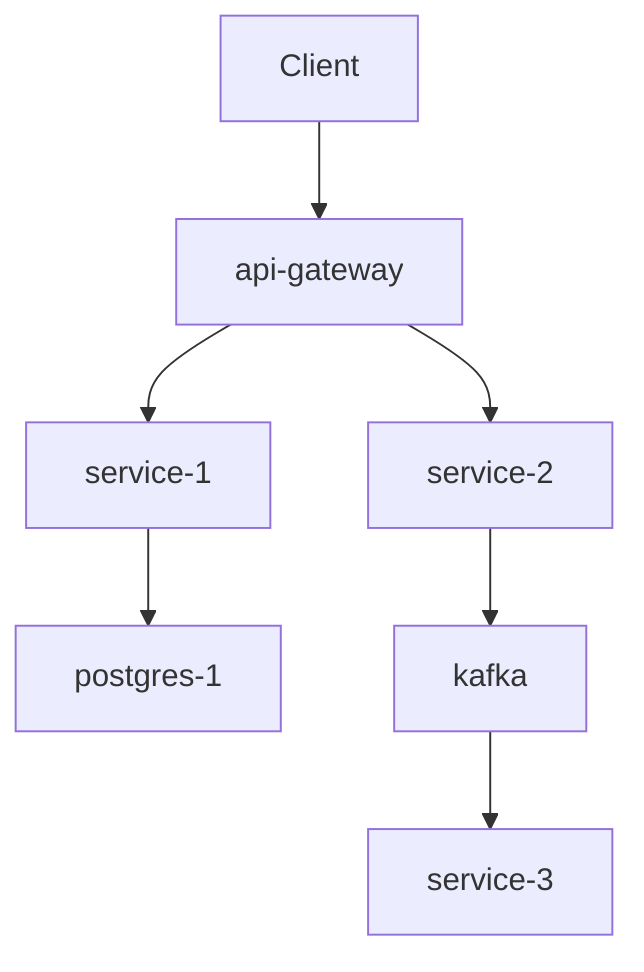
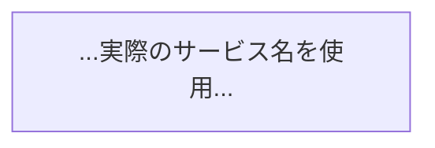
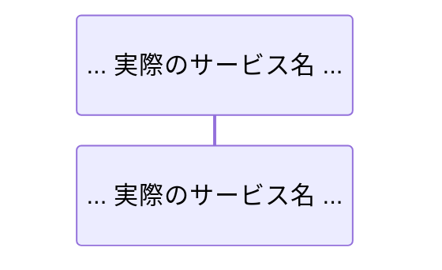

# microservices-wiki 出力フォーマット仕様

## ファイル命名規則

```
<番号>-<kebab-case-title>.md
```

例:
- `index.md` - メインインデックス
- `1-system-overview.md` - セクション概要ページ
- `1.1-architecture-overview.md` - アーキテクチャ概要（必須・最重要）
- `1.2-service-catalog.md`
- `2.1-api-gateway-and-routing.md`
- `3.1-database-per-service.md`

---

## 5セクション構成テンプレート

### セクション定義と最小ページ数

| セクション | 必須 | 最小ページ数 | 内容 |
| :--- | :--- | :--- | :--- |
| 1. System Overview | ★ | 2 | 全体アーキテクチャ概要・サービス一覧 |
| 2. Service Communication | ★ | 2-3 | API Gateway・同期/非同期通信 |
| 3. Data Architecture | ★ | 2 | DB設計・データフロー |
| 4. Infrastructure & Deployment | ★ | 2-3 | コンテナ・ネットワーク・CI/CD |
| 5. Cross-Cutting Concerns | - | 2-3 | 認証・可観測性・耐障害性 |

> **Core ページ (1.1, 1.2, 2.x) が全体ページ数の 40-60% を占めるのが正常。**

---

## index.md の構造

```markdown
# [プロジェクト/組織名] Microservices Architecture

[システムの概要: 何のためのシステムか、何個のサービスで構成されているか、
主要な技術スタックを2-3段落で説明]

## 技術スタック全体

| カテゴリ | 技術 |
|---------|------|
| API Gateway | nginx / Kong / AWS API Gateway |
| 同期通信 | REST (HTTP/2), gRPC |
| 非同期通信 | Apache Kafka / RabbitMQ |
| データストア | PostgreSQL, MySQL, Redis |
| コンテナ基盤 | Docker + Kubernetes |
| CI/CD | GitHub Actions |

## アーキテクチャ全体図



## 目次

### 1. [System Overview](./1-system-overview.md)
- [1.1 Architecture Overview](./1.1-architecture-overview.md)
- [1.2 Service Catalog](./1.2-service-catalog.md)

### 2. [Service Communication](./2-service-communication.md)
- [2.1 API Gateway & Routing](./2.1-api-gateway-and-routing.md)
- [2.2 Synchronous Communication](./2.2-synchronous-communication.md)
- [2.3 Asynchronous Communication](./2.3-asynchronous-communication.md)

### 3. [Data Architecture](./3-data-architecture.md)
- [3.1 Database per Service](./3.1-database-per-service.md)
- [3.2 Data Flow & Consistency](./3.2-data-flow-and-consistency.md)

### 4. [Infrastructure & Deployment](./4-infrastructure-and-deployment.md)
- [4.1 Container Orchestration](./4.1-container-orchestration.md)
- [4.2 Service Mesh & Networking](./4.2-service-mesh-and-networking.md)
- [4.3 CI/CD Pipeline](./4.3-ci-cd-pipeline.md)

### 5. [Cross-Cutting Concerns](./5-cross-cutting-concerns.md)
- [5.1 Authentication & Authorization](./5.1-authentication-and-authorization.md)
- [5.2 Observability](./5.2-observability.md)
- [5.3 Error Handling & Resilience](./5.3-error-handling-and-resilience.md)
```

---

## 個別ページの構造（importance: high 基準）

```markdown
# [ページタイトル（英語）]

[概要: 2-3文。このページが扱うスコープを明示。
「このページでは X を説明する。Y の内部実装の詳細は各サービスのWikiを参照。」]

## [セクション1: アーキテクチャ/全体像]

[コンポーネントの役割と関係を説明。実際のサービス名・技術名を使う。]

| サービス | プロトコル | エンドポイント / Topic | 役割 |
|:---|:---|:---|:---|
| `order-service` | REST | `GET /users/{id}` | 注文時のユーザー検証 |
| `order-service` | Kafka | `order-created` | 注文確定後の通知トリガー |



```yaml
# docker-compose.yml:L45-L62
order-service:
  environment:
    USER_SERVICE_URL: http://user-service:3001
    KAFKA_BROKERS: kafka:9092
```

**Sources:** [docker-compose.yml:L45-L62](file:///絶対パス/docker-compose.yml#L45-L62)

## [セクション2: 処理フロー]



**Sources:** [openapi.yaml:L100-L150](file:///絶対パス/openapi.yaml#L100-L150)

## 関連ページ

- [← 前: ページタイトル](./対応ファイル名.md)
- [→ 次: ページタイトル](./対応ファイル名.md)
- [関連: ページタイトル](./対応ファイル名.md)
```

---

## ページ品質最低要件早見表

| importance | 語数 | Mermaid | 種類 | スニペット | Sources行 | テーブル |
| :--- | :--- | :--- | :--- | :--- | :--- | :--- |
| **high** | 1200+ | 2-3 | **2種類+** | **5-8** | 全セクション | **1+** |
| **medium** | 600-1000 | 1-2 | 1種類+ | 3-5 | 全セクション | 推奨 |
| **low** | 300-500 | 1 | 1種類+ | 1-2 | 主要セクション | 任意 |

> **スニペットはインフラ定義ファイル（yaml, tf, conf, proto, sql）からの直接引用のみ。疑似コード禁止。**
