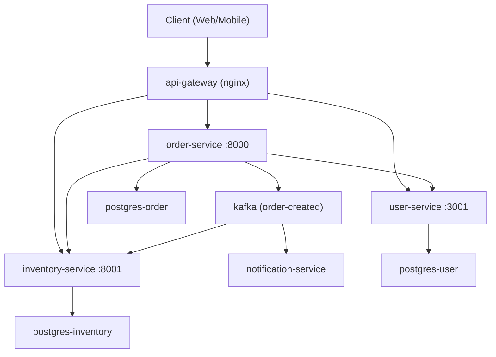
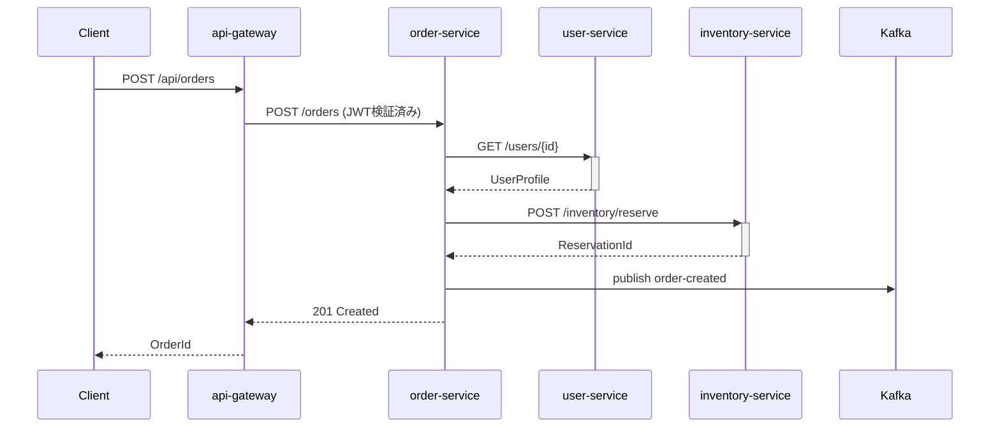
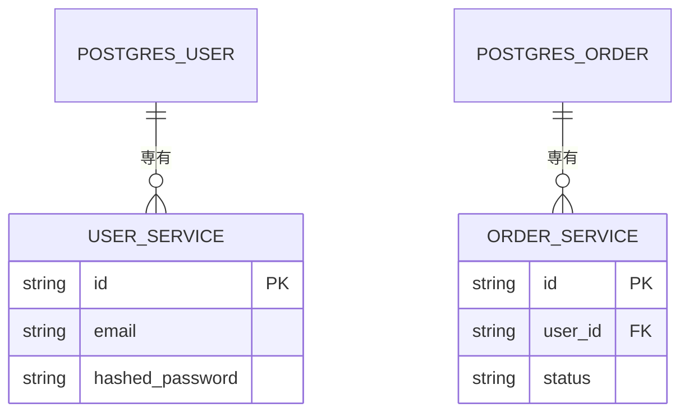

# microservices-wiki テンプレート・具体例集

ルール・手順・品質基準は [SKILL.md](../SKILL.md) を参照。本ファイルはテンプレートと具体例のみ。

---

## Phase 1: アーキテクチャ概要メモのテンプレート

### サービス一覧テーブルの形式

```text
### 検出されたサービス一覧

| サービス名 | 技術スタック | ポート | データストア | 役割（推定） |
| :--- | :--- | :--- | :--- | :--- |
| user-service | Node.js + Express | 3001 | PostgreSQL (専有) | ユーザー認証・プロファイル管理 |
| order-service | Python + FastAPI | 8000 | MySQL (専有) | 注文ライフサイクル管理 |
| inventory-service | Go | 8001 | PostgreSQL (専有) | 在庫・商品管理 |
| notification-service | Node.js | 8002 | Redis (キャッシュ専有) | メール・Push通知送信 |
| api-gateway | nginx / Kong | 80, 443 | - | 外部ルーティング・認証 |
```

### サービス間通信の記録形式

```text
### サービス間通信

#### 同期通信 (REST/gRPC)
- order-service → user-service: GET /users/{id}
  (根拠: docker-compose.yml の USER_SERVICE_URL 環境変数)
- order-service → inventory-service: POST /inventory/reserve
  (根拠: openapi.yaml の paths セクション)

#### 非同期通信 (Kafka / RabbitMQ)
- order-service → [kafka:order-created] → notification-service
  (根拠: docker-compose.yml の KAFKA_TOPIC_ORDER_CREATED)
- order-service → [kafka:order-created] → inventory-service
  (同一 topic に複数 subscriber)

#### API Gateway ルーティング
- /api/users/* → user-service:3001
- /api/orders/* → order-service:8000
- /api/inventory/* → inventory-service:8001
(根拠: nginx/default.conf のプロキシ設定)
```

### データストア分析の記録形式

```text
### データストア構成

#### 専有データストア（推奨パターン）
- user-service: PostgreSQL (users, sessions テーブル)
- order-service: MySQL (orders, order_items テーブル)
- inventory-service: PostgreSQL (products, stock テーブル)

#### 共有・注意が必要な構成
- ⚠️ user-service と order-service が同一 Redis インスタンスを共有
  (docker-compose: REDIS_HOST が両サービスで一致)
  → セッションキャッシュ目的のみ。スキーマ競合リスク低

#### メッセージキュー
- Kafka: order-created, payment-completed, stock-updated (3 topics 検出)
- 全 topic は docker-compose の kafka サービス定義を参照
```

---

## Phase 3: Wiki構造 JSON テンプレート

```json
{
  "title": "EC Platform - Microservices Architecture Wiki",
  "description": "ECプラットフォームのマイクロサービス全体アーキテクチャドキュメント",
  "sections": [
    {
      "id": "1",
      "title": "System Overview",
      "pages": [
        {
          "id": "1.1",
          "title": "Architecture Overview",
          "inputSources": [
            "docker-compose.yml",
            "k8s/deployments/",
            "README.md"
          ],
          "importance": "high",
          "relatedPages": ["1.2", "2.1"],
          "keyDiagrams": ["全体構成 flowchart TD", "リクエストフロー sequenceDiagram"]
        },
        {
          "id": "1.2",
          "title": "Service Catalog",
          "inputSources": [
            "docker-compose.yml",
            "k8s/deployments/*.yaml"
          ],
          "importance": "high",
          "relatedPages": ["1.1", "2.1", "3.1"]
        }
      ]
    },
    {
      "id": "2",
      "title": "Service Communication",
      "pages": [
        {
          "id": "2.1",
          "title": "API Gateway and Routing",
          "inputSources": [
            "nginx/default.conf",
            "api-gateway/routes.yaml"
          ],
          "importance": "high",
          "relatedPages": ["1.1", "2.2"]
        }
      ]
    }
  ]
}
```

---

## Phase 4a: ソース分析メモのテンプレート

各インフラ定義ファイルを読んだ直後に記録する：

```text
### ファイル: docker-compose.yml (L1-L180 読了)

■ スニペット候補
  1. user-service の services 定義 (L12-L35): ポート・環境変数・依存サービスを示す
  2. order-service の環境変数 (L45-L62): USER_SERVICE_URL → サービス間依存の証拠
  3. kafka の定義 (L100-L130): topic 設定、retention 設定
  4. postgres の定義 (L140-L155): 専有DBパターンの例
  5. networks セクション (L165-L180): サービス間ネットワーク分離の構成

■ 検出されたサービス
  user-service, order-service, inventory-service, notification-service, api-gateway,
  postgres-user, postgres-order, redis, kafka, zookeeper

■ サービス間環境変数（依存の証拠）
  order-service: USER_SERVICE_URL=http://user-service:3001
  notification-service: KAFKA_BROKERS=kafka:9092

■ データストア構成
  postgres-user: user-service 専有 (同一ネットワーク内のみ)
  postgres-order: order-service 専有
  redis: user-service と notification-service が共有 ⚠️

■ 注目すべき設計上の特徴
  - Database per Service パターンが概ね実装されている
  - Redis 共有があり、今後の分離を検討すべき可能性
  - Kafka による非同期通信の存在
```

---

## Phase 4b: ページ生成テンプレート

### Architecture Overview ページ (importance: high) の構成例

```markdown
# Architecture Overview

[概要: このページでシステム全体のアーキテクチャを説明する。個々のサービスの内部実装詳細は
各サービスの Wiki（deepwikiが生成）を参照のこと。]

## システム概要

[サービス数・技術スタック・アーキテクチャパターンの概説]

| サービス | 技術 | 役割 |
|:---|:---|:---|
| `user-service` | Node.js + Express | ユーザー認証・プロファイル |
| `order-service` | Python + FastAPI | 注文ライフサイクル |
| `inventory-service` | Go | 在庫・商品管理 |



**Sources:** [docker-compose.yml:L1-L80](file:///path/docker-compose.yml#L1-L80)

## サービス間通信フロー

[注文処理を例に、サービス間の同期・非同期通信を説明]



**Sources:** [docker-compose.yml:L45-L65](file:///path/docker-compose.yml#L45-L65), [openapi.yaml:L1-L50](file:///path/openapi.yaml#L1-L50)
```

---

## Mermaid ダイアグラムのルール

### ダイアグラム種類の使い分け

| 目的 | ダイアグラム種類 | 使用場面 |
| :--- | :--- | :--- |
| 全体構成 | `graph TD` / `flowchart TD` | サービス依存関係、コンポーネント構成 |
| 時系列処理 | `sequenceDiagram` | サービス間のAPI呼び出し、リクエストフロー |
| DB構成 | `erDiagram` | データストアの関係、テーブル構成 |
| 状態遷移 | `stateDiagram-v2` | デプロイ状態、サービスライフサイクル |

- **必須: 厳密な縦方向 (Vertical) レイアウト**
  - フローダイアグラムの指定には必ず `graph TD` (top-down) または `flowchart TD` を使用すること。
  - **絶対に `graph LR` (left-right) や `flowchart LR` を使用しないこと。**
  - ノード内のテキストは最大でも3-4単語に収め、横幅が長くなりすぎないようにすること。

- **シーケンス図 (Sequence Diagrams) の厳格なルール:**
  - 先頭行に必ず単独で `sequenceDiagram` を配置すること。
  - その直後に、使用する全参加者を `participant` キーワードで定義すること（例: `participant GW as api-gateway`）。
  - 以下のアロー構文（8種類）から意図に合ったものを正確に使用すること:
    - `->>` : 実線・矢じりあり (**リクエストや呼び出しに最も使用**)
    - `-->>` : 破線・矢じりあり (**レスポンスや戻り値に最も使用**)
    - `-x` : 実線・末尾がX (エラー・失敗)
    - `--x` : 破線・末尾がX (エラーレスポンス)
    - `-)` : 実線・オープンアロー (非同期、投げっぱなし)
  - アクティベーションボックスには必ず `+`/`-` プレフィックスを使用すること（例: `A->>+B: Start`, `B-->>-A: End`）。
  - メッセージへのラベル付与にはコロン（`:`）を用いること。**絶対にフローチャート風の `A--|label|-->B` 表記を使用しないこと。**

- **【🔥 致命的エラー防止: 全般的な構文ルール（絶対厳守）】**
  - ノードラベルに `()`、`[]`、`{}` などの括弧や記号類が含まれる場合は、**例外なく必ず `["ラベル"]` のようにダブルクォーテーションで囲む**こと。クォート忘れは致命的なパースエラーを引き起こします。
  - **【頻出エラー1】** `D[Data Pipeline (api/data_pipeline.py)]` のように `[]` の内側に `()` を含むとパースエラーで図が崩壊します。**必ず `D["Data Pipeline (api.py)"]` とクォートで囲むか、括弧を使用しないでください。**
  - **【頻出エラー2】** サービス名にハイフンを含む場合もクォートが必要です。例: `order-service["order-service"]`（ノードIDにもハイフン不可）。
  - HTMLタグは使用不可（`<` や `>` などの記号もパースエラーの原因）。
  - ノード ID にハイフンを含めない（アンダースコアを使用すること。例: `order-service` ❌ → `order_service` ⭕️）。
  - サンプルの汎用名ではなく、**実際のサービス名・コンポーネント名**をノードラベルに用いること。

### サービス名の命名規則

```text
✅ 良い例（実際のサービス名）:
  user_service["user-service"], order_service["order-service"],
  api_gw["api-gateway"], kafka["Kafka"], pg_user["postgres-user"]

❌ 悪い例（汎用的な名前 / IDにハイフン）:
  ServiceA, Backend, Database, Message Queue
  order-service["order-service"]  ← ノードIDにハイフンはNG
```

### 通信プロトコルの明記

```text
✅ 良い例:
  user_svc["user-service"] -->|"REST GET /users/{id}"| pg_user["postgres-user"]
  order_svc["order-service"] -->|"Kafka: order-created"| notify_svc["notification-service"]

❌ 悪い例（プロトコル不明）:
  UserService --> Database
  OrderService --> NotificationService
```

### データストア構成図の例（erDiagram）



---

## Sources 行の書き方（アーキテクチャWiki版）

```text
✅ 良い例:
**Sources:** [docker-compose.yml:L12-L45](file:///path/docker-compose.yml#L12-L45),
             [k8s/deployment-order.yaml:L1-L40](file:///path/k8s/deployment-order.yaml#L1-L40),
             [openapi.yaml:L100-L150](file:///path/openapi.yaml#L100-L150)

✅ 個別Wikiへの参照（deepwiki生成済みの場合）:
**Sources:** [order-service Architecture](file:///path/order-service/docs/wiki/1.1-architecture-overview.md)

❌ 悪い例:
Sources: docker-compose.yml  ← ファイル参照なし
Sources: [docker-compose.yml] ← 行番号なし
```

---

## セルフレビューチェックリスト

各ページを出力する前に確認する：

> [!CAUTION]
> ページを1つ書き出したら**必ず** `validate_arch_page.py` を実行してから次のページに進む。

- [ ] Mermaid のノードラベルに実際のサービス名が使われているか
- [ ] サービス間の通信にプロトコル（REST/gRPC/Kafka等）が明記されているか
- [ ] Sources 行に行番号付きのインフラ定義ファイルが参照されているか
- [ ] コードスニペットが実際の設定ファイルからの引用か（疑似コードでないか）
- [ ] importance: high なら Mermaid が 2 種類以上あるか
- [ ] テーブルでサービス一覧・API一覧・DB一覧が整理されているか
- [ ] 個別サービスの内部実装に踏み込んでいないか（スコープ逸脱）
- [ ] 関連ページへのリンクが正しいファイル名を指しているか
